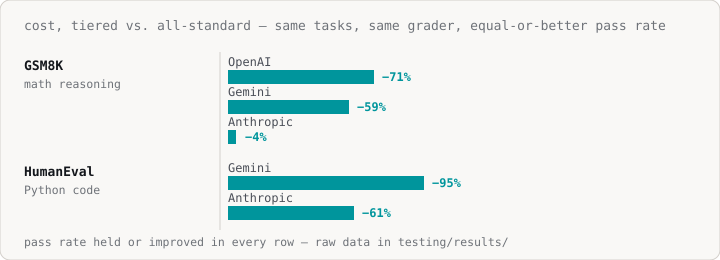
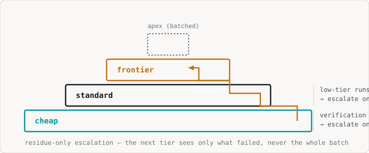
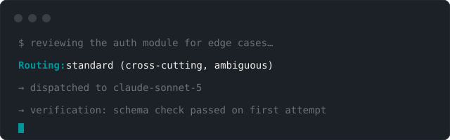
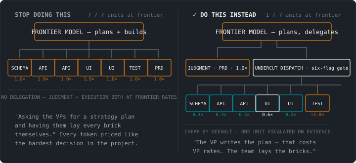

<p align="center">
  
</p>

<p align="center"><strong>Undercut the top-tier model. Never the quality bar.</strong></p>

<p align="center">
  <a href="LICENSE"></a>
  <a href="CHANGELOG.md"></a>
  <a href="https://getundercut.sh"></a>
</p>

Run every unit of work at the cheapest model that can pass verification.
Escalate on evidence, not vibes.

> The install slug is `tiered-dispatch`; the product is **Undercut**.

Measured, not promised: **up to −95% cost on public benchmarks, equal-or-better
quality, across 4 model families.** Every number below is reproducible from the
raw data in [`testing/`](testing/).

## The proof (measured, 2026-08)

<p align="center">
  
</p>

We A/B-tested the skill against "one model for everything" on third-party,
MIT-licensed benchmarks — **official test cases, not ours**. Each cell: same
tasks, same grader, only the routing policy changes.

### GSM8K (math reasoning) — 50 tasks × 5 seeds

| Model family | all-standard | tiered | cost | quality |
|---|---|---|---|---|
| OpenAI | 241/250 | **249/250** | **−71%** | +8 correct |
| Gemini | 250/250 | 248/250 | −59% | −2 (noise) |
| Anthropic | 249/250 | **250/250** | −4% | +1 |

### HumanEval (Python code) — 20 tasks × 5 seeds, official test cases

| Model family | all-standard | tiered | cost | quality |
|---|---|---|---|---|
| Gemini | 100/100 | 100/100 | **−95%** | = |
| Anthropic | 100/100 | 100/100 | **−61%** | = |
| OpenAI | 100/100 | 100/100 | NA\* | = |

\*NA — OpenAI's cheap tier can't write Python, so there's no cost headroom on
code for that family. Quality is still preserved (the escalator works).

### Why you can trust these numbers

1. **Public, uncontested tasks** — GSM8K and HumanEval, graded against their
   official test cases. We didn't author the graders that decide "correct."
2. **Vendor-constant** — each family is compared to itself. No cross-vendor
   apples-to-oranges.
3. **Deterministic graders, never an LLM judge.**
4. **Raw data is published** in [`testing/results/`](testing/results/) — every
   cell re-verifiable, every attempt trace included.

Full tables, the flagging-reliability study, and reproduction steps:
[`testing/README.md`](testing/README.md).

## The problem

Coding agents route almost everything to the most expensive model available,
by default and by habit. The "ask the model how confident it is, then route"
fix doesn't work — self-reported model confidence is poorly calibrated. A
model that's wrong is frequently just as "confident" as one that's right.

## The core idea — the generator–verifier gap

If a task's output is cheap to verify mechanically — tests, schema
validation, a diff, a spot-check — it is safe to *attempt* at the cheapest
tier regardless of how hard the task looks. Escalation should happen on
verification failure, not on predicted difficulty. Only unverifiable judgment
work needs to start on an expensive model. This gap is the single biggest
lever in the system.

## How it works

**Base tier: a 6-flag rubric.** Score each unit on whether it's unverifiable,
ambiguous, high blast radius (irreversible, money, auth, user data),
cross-cutting, novel, or format-strict. 0 flags → cheap. 1–2 → standard.
3+, or any ownership/judgment call → frontier.

**3 objective escalation triggers**, one tier at a time:

1. Verification fails twice at the current tier.
2. Two low-tier runs on ambiguous work disagree.
3. The worker tags an item `uncertain`.

**Residue-only escalation.** A higher tier sees only the items that failed
or were flagged — never the whole batch.

**Hysteresis.** Never de-escalate mid-task. One retry per tier, max.
Everything unresolved goes to a single batched apex-tier tie-break call —
never per-item apex calls.

**Flags steer; verification + escalation decide.** Wrong flags cost at most
one extra cheap attempt. A stock dispatcher reproduced only 90% of rubric
flags yet still routed 100% of units to the correct tier.

<p align="center">
  
</p>

Every non-trivial dispatch narrates the tier it landed on and why, right in
the transcript — no hooks, no opt-in step required:

<p align="center">
  
</p>

## What this optimizes

Two payrolls hide in every request. Only one gets tiered.

"Build me a minimum-viable CRM I can use for my small business" isn't one
job — it's a planning phase (what should this even do, which tradeoffs
matter) billed at judgment rates, then an execution phase (the schema, the
endpoints, the screens, the tests) that doesn't need to be. The rubric above
tiers the second phase. It has no opinion on the first, and judgment tokens
are usually the expensive half to begin with.

<p align="center">
  
</p>

**Stop doing this:** one frontier model handles the PRD, the schema, and
every CRUD screen and test — a staffing mistake before it's a cost one.
Sending one model both jobs means every token, from the ambiguous tradeoff
to the boilerplate screen, gets billed at the rate of the hardest decision
in the project.

**Do this instead:** the judgment slice (PRD, ambiguous schema tradeoffs)
stays at frontier — nobody's claiming otherwise, that's still expensive. The
execution slice — usually most of the token volume — gets tiered like every
other verifiable unit: cheap by default, escalated only on evidence.

|  | Judgment tokens | Execution tokens | Blended |
|---|---|---|---|
| Share of the request | 50% | 50% | 100% |
| Does the rubric apply? | not yet proven | yes | — |
| Measured reduction ([GSM8K/OpenAI](#the-proof-measured-2026-08)) | 0% | 71% | ~36% |

**The measured up to −71% is on execution work. Half your tokens at that
reduction is ~36% off the whole session — not 71%.** Skew more
execution-heavy than 50/50 and the blended number moves toward 71%; more
planning-heavy, and it moves toward 0%. Whichever way your workload leans,
the number you get is the honest one — not the headline one.

## Honest limitations

- **Sample sizes are modest** (50/20 tasks × 5 seeds). Direction is
  consistent across 2 benchmarks × 4 model families; every headline cell now
  carries a Wilson-interval confidence bound (`evals/src/stats.js`), but a
  modest N still means a wide interval — read the bound, not just the point
  estimate.
- **Open-weights price ladders invert** — their "standard" tier can be cheaper
  than "cheap", which flips the cost math (quality still equal). See
  [`testing/README.md`](testing/README.md).
- **Real workloads are messier** than benchmarks and escalate more — real
  savings land below these numbers, not above.

## Install

**Requirements:** none beyond the coding agent itself. `npx skills add`
needs Node.js/npm (for `npx`) and network access to the skills.sh registry;
the manual `cp -r` copy below needs neither. No API key, no account, no
build step.

**Claude Code** can also install via plugin (this repo doubles as its own
marketplace):

```
/plugin marketplace add undercutsh/firstpass
/plugin install firstpass@firstpass
```

Every other client — and Claude Code too, if you'd rather skip the
plugin — uses the generic installer:

```
npx skills add undercutsh/firstpass
```

Or copy `skills/firstpass/` into your agent's skills directory by hand.
Every client uses its own directory:

- **Claude Code** → `.claude/skills/firstpass/`
- **Codex CLI** → `.agents/skills/firstpass/`
- **Cursor** → `.cursor/skills/firstpass/`
- **Copilot** (no skills dir — instructions file instead) → append to
  `.github/copilot-instructions.md` or `AGENTS.md`

Full install steps for these plus OpenCode, Gemini CLI, Windsurf, JetBrains
Junie, Amp, Devin, and 24 more clients (Cline, Zed, Warp, Cody, Continue,
Roo Code, Kiro, Void, Trae, Bolt, Factory, Lovable, Qoder, Tabnine, Jules,
JetBrains AI Assistant, Amazon Q Developer, Firebase Studio, Aider,
OpenHands, Kilo Code, Augment Code, Goose, and Replit Agent) —
exact commands, a verify-your-install prompt, and troubleshooting — are in
[`AGENTS.md` → Client install matrix](AGENTS.md#client-install-matrix).

**For AI coding agents working in this repo:** see [`AGENTS.md`](AGENTS.md)
for build/test commands and repo conventions.

**For developers looking for an API or MCP server:** see
[getundercut.sh/developers](https://getundercut.sh/developers) — there isn't
one yet; here's what exists today and where to hear about it when it ships.

**Optional, for Claude Code — [`hooks/`](hooks/):** a local, opt-in package
that guarantees the rubric is in context every session and prints a
session-end receipt with real token/cost data (never a guess). No network
calls, no telemetry, nothing leaves your machine. Skip it entirely and the
core skill works exactly as described above — see [`hooks/README.md`](hooks/README.md)
for install steps.

## What this is and isn't

This is policy the orchestrating agent follows at dispatch time. It is not a
proxy, and it does not enforce anything at the network layer. It composes
with gateways: route first, compress second.

## Prior art

Tier-based subagent routing isn't new. This skill's contribution is the
**objective escalation loop**: measured disagreement instead of self-reported
confidence, hysteresis so a run can't thrash between tiers, residue-only
escalation with a structured handoff payload, and a calibration feedback loop
that turns each run's misses back into rubric edits. Plus — unlike the
alternatives — **published, reproducible A/B results** for whether it works.

## Reproduce

```sh
cd evals
export OPENROUTER_API_KEY=sk-or-...
node src/main.js --verify-only
node src/main.js --policy probe --seeds 5
node src/main.js --benchmark gsm8k,humaneval --policy probe --seeds 5
node src/main.js --flagtest --policy probe
node src/main.js --compare testing/results/run-a.json testing/results/run-b.json
```

---

MIT · founded by [Justin Winter](https://iamjustinwinter.com) · [getundercut.sh](https://getundercut.sh)
